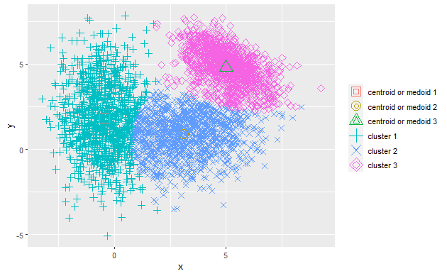
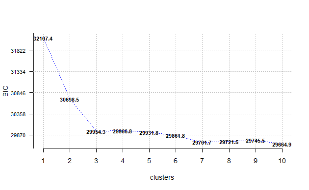
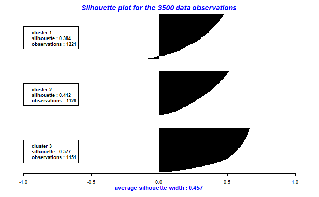
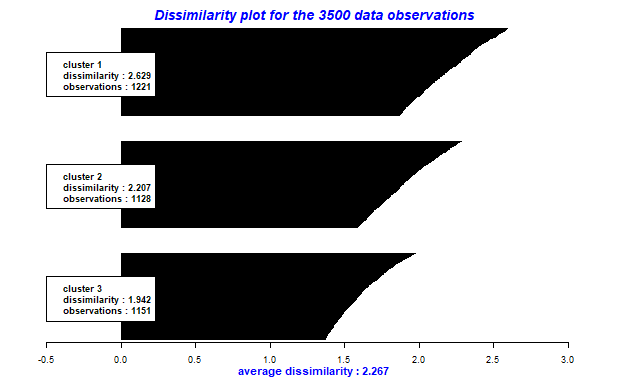

```{r setup, include=FALSE} 
knitr::opts_chunk$set(warning = FALSE, message = FALSE) 
library(MASS)
library(dplyr)
library(ClusterR)
library(tidyverse)
source("functions.R")
```

\newpage

# Introduction

ClusterR is an R package for clustering data.
It contains some built-in functions for K-Means/Medoids and Gaussian Mixture Models.

Documentation can be found at https://cran.r-project.org/web/packages/ClusterR/.


# Unsupervised Learning

Statistical learning problems can be divided in two main categories: supervised and unsupervised.
They both aim to extract information from a set of observations $x_i$, with $1 \leq i \leq n$.
Each $x_i$ is a vector of $p$ predictor variables.

The supervised framework assumes to have as input also the associated response $y_i$ for each corresponding $x_i$.
A classical example of supervised learning is the logistic regression.

The unsupervised learning instead relies only on the observations $x_i$ without any associated response $y_i$.
Since we do not have $y_i$, we cannot apply any type of checks or optimizations on the
error between real and predicted values for the response variable.

We can state that given $X_1, ..., X_p$ variables the goal is to discover 
any type of correlation or pattern between the variables.
In the unsupervised framework, the most known class of methods is the Cluster Analysis.

# Cluster Analysis

Clustering is the task of dividing the population or data points into a
number of groups such that data points in the same groups are
similar to other data points in the same group and dissimilar to the
data points in other groups. Basically, it is a collection of objects on
the basis of similarity.

Clustering is suitable for explaining the
possible data-generating process, for finding possible relations/hierarchies 
between data or as a part of the exploratory data analysis.

For doing clustering it is necessary to define a measure of similarity:
similar items should belong to the same group. A measure of similarity
must be non-negative, symmetric and must have a value of zero only if
the items are equal. There are various possible similarity measures, for
example: euclidean distance, manhattan distance and maximum distance. A
clustering library should give the possibility to specify the similarity
function to be used.

A predictive algorithm based on clustering may for example use the value
of nearest cluster to give the response for a new data point. It is also
possible to combine the informations of all clusters, weighted by the
cluster distances.
There are four main approaches in clustering: 

 * Connectivity based 
 * Centroid based
 * Distribution based 
 * Density based

## Connectivity based

Connectivity-based clustering tries to create connections between the
clusters. In this way the algorithm creates a tree (or a forest), which
gives an hierarchial view of the data. Two possible uses can be
creating a cause-effect relationship between items or reconstructing a
possible evolution of a population.

Algorithms in this class: Agglomerative (Divisive) Hierarchical Clustering.

## Centroid based

Centroid-based clustering is based on centroids: each item belongs to
the class of its nearest centroid. The centroids can be restricted to
locations of the items (medoid) or generic points (centroid). The number
of centroids can be hard-coded or optimized by the algorithm; the
positions of the centroids is always optimized by the algorithm. 

Algorithms in this class: K-Means, K-Medoids.

### K-means and K-medoids

K-means initially creates k random points which represent the
centroids. Then, for each iteration, the algorithm moves the centroid
positions to optimize the clustering metric. The k-medoid algorithm is a
variation of k-means, which changes the way to calculate the new center of each cluster:

 - **k-means**: uses the mean of all its points (which is not necessarily a point of the cluster)
   * pros: algorithms are linear in time complexity
 - **k-medoids** uses the median point of the cluster (so a point of the cluster)
   * pros: is less influenced by noise and outliers.
   * cons: algorithms are quadratic in time complexity
   
 
## Distribution based 

Distribution-based clustering uses a probabilistic model to explain the
original data-generating model, by minimizing the discrepancy. By doing
so, it is possible to create specific models that accurately describe
the data and give an idea of the prediction confidence.

Algorithms in this class: Gaussian Mixture Models.

### GMM: Gaussian Mixture Model

The most known and effective distribution-based algorithm is GMM.
GMM models the data-generating process as a set of
gaussian distributions, one for each cluster. Doing so, each gaussian (cluster)
gives the probability density function of the points it generates. 
During inference/prediction, a point point is assigned to the cluster that maximizes the probability.

GMM can be seen as an extension of the K-means, which assumes 
that the clusters are non-overlapping and have a circular shape.
GMM instead is effective also if the first assumption does not hold 
and the second is relaxed, requesting an ellipsoidal shape.

GMM uses generalized gaussian distributions, so each cluster $k \in \{1,..,K\}$ has its own
independent mean and variance.
The goal is to estimate the parameter $\theta_k = (\mu_k, \Sigma_k, \pi_k)$, where:

 - **mean $\mu_k$**: defines the center
 - **covariance matrix $\Sigma_k$**: defines the width
 - **weight $\pi_k$**: defines the weight in percentage of each component ($\pi_k$ is a probability itself, so: $\Sigma_{i=1}^K \pi_i = 1$)

To discover the above parameters, Expectation-Maximization (EM) Algorithm is used.
Basically, is based on two alternating steps:

 - **Expectation**: computes the posterior probabilities
 - **Maximization**: updates the parameters given the newly computed posterior

## Density based

Density-based clustering groups data using distance between points.
Dense connected regions of points should be part of the same cluster. 
In this way there is not a fixed number of clusters, but the number of
clusters depends on the data distribution and the chosen density threshold. 

Algorithms in this class: DBSCAN, OPTICS.


# Data Generation

To test the various cluster algorithms first of all we need some data.
We have created a synthetic dataset drawn
from $k=3$ different 2-dimensional gaussian distributions (so $d=2$).

To do it we used the library MASS, which defines the function \verb|mvrnorm|:
specifying the number $n$ of samples, the mean $\mu \in \mathbb{R}^d$ and the correlation matrix 
$\Sigma \in \mathbb{R}^{d*d}$, it returns a matrix
representing $n$ observations $x_1, ... , x_n$, with each $x_i \in \mathbb{R}^d$ 
generated from a simulation of a Multivariate Normal Distribution.

We generated and combined three matrices (one for each gaussian generating process) into a single dataframe, where the column "color" specifies the generating distribution.

Finally, we visualized the data using a scatter plot,
where the digits indicate the positions of the centroids.

```{r include=FALSE}
factor = 100
coeff = log(base=10, factor)/2 #choose if augmenting distance when generating more points
# sort points da X coordinate, so will be easier to re-order also the centroids of the gmm / kmeans accordingly
points_mean = list(
  c(-0.5, 2), 
  c(3, 1),
  c(5, 5)
)
points_cov_mat = list(
  matrix(c(0.8, 0, 0, 4),  ncol = 2),
  matrix(c(3, .7, 0, 2),  ncol = 2),
  matrix(c(1, -.6, 0, 1), ncol = 2)
)
  
# create bivariate normal distribution
df1 = bind_rows(list(
  data.frame(mvrnorm(n = 10 * factor, mu = points_mean[[1]], Sigma = points_cov_mat[[1]]), color=1),
  data.frame(mvrnorm(n = 15 * factor, mu = points_mean[[2]], Sigma = points_cov_mat[[2]]), color=2),
  data.frame(mvrnorm(n = 10 * factor, mu = points_mean[[3]], Sigma = points_cov_mat[[3]]), color=3)
))
# select only Xi columns (drop color column)
df1_no_label = subset(df1, select=c(X1, X2))
```

```{r}
{
plot(x=df1$X1, y=df1$X2, col=df1$color + 1)
plot_points(points_mean, num_points=3)
}
```

# The Package

ClusterR is a package designed for cluster generation and analysis. 
It supports Distribution-based and Centroid-based algorithms. 
It also contains some helper functions and example datasets.

The package is subdivided in different parts: 

* clustering algorithms
* searching the optimal number of clusters
* prediction using the generated clusterings
* visualization of the clustering goodness with 2D scatterplots and silouhette dissimilarity plots 
* validation of the clustering goodness using ground truth labels
* helper methods

## Gaussian Mixture Models

In the library, to compute the Gaussian Mixture Models there is the function \verb|GMM|, which has the following arguments: 

 * (mandatory) **data**: the matrix with the observations (one row per item, one column per component) 
 * (mandatory) **n_gaus**: the number of gaussian processes
 * **dist_mode**: specifies if the training algorithm should use euclidean or manhattan distance
 * **seed_mode**: specifies the initial placement of the centroids for the iterative algorithm (static/random subset/spread)
 * **km_iter**: number of iterations for the k-means algorithm
 * **em_iter**: number of iterations for the expectation-maximization algorithm
 * **var_floor**: smallest possible values for diagonal covariances
 * **seed**: integer for the random number generator (to allow replicability)
 
```{r echo=TRUE}
gmm_3 = GMM(df1_no_label, 3, dist_mode = "maha_dist", seed_mode = "random_subset")
gmm_3 = reorder_data(gmm_3, "centroids", list("weights", "covariance_matrices"))
df1["y_3gmm"] = predict(gmm_3, newdata = df1_no_label)
```

```{r, echo=FALSE}
{
plot(x=df1$X1, y=df1$X2, col=df1$y_3gmm + 1)
plot_points(points_mean, num_points=3)
points(gmm_3$centroids, pch="X", cex=2, col="azure")
}
```


It is also possible to use the function \verb|plot_2d|, defined by by the ClusterR package, for a 2D visualization of the predicted points along with the centroid/medoid positions. The arguments are:

 * (mandatory) **data**: 2-dimensional matrix specifying the item positions
 * (mandatory) **clusters**: a list specifying the class for each item (numeric vector)
 * (mandatory) **centroids_medoids**: the position of the centroids (or medoids)


```{r}
plot_2d(data = df1_no_label, clusters = df1$y_3gmm, centroids_medoids = gmm_3$centroids)
```


<!-- bug in knit does not show plot, add image manually: -->

```{r echo = FALSE, message=FALSE, fig.align='center', out.width='0.9\\linewidth', fig.pos='H'}

```


The function \verb|external_validation|, also defined in the ClusterR package, gives us the possibility to extract some useful metrics measuring the goodness of the fit. It requires only the predicted values and annotated values. 

The arguments are:

- (mandatory) **true_labels**, **clusters**: respectively the annotated values and the predicted values
- **method**: specify which summary statistic should the function return
- **summary_stats**: whether or not to print all the summary statistics

```{r}
external_validation(df1$color, df1$y_3gmm, summary_stats = T)
```

The GMM object returned by the function is a list with 5 components: 

- **centroids**: a matrix $\in \mathbb{R}^{k*d}$ that specifies the position of each centroid
- **covariance_matrices**: a matrix $\in \mathbb{R}^{k*d}$ that specifies the diagonal values of each covariance matrix
- **weights** a vector $\in \mathbb{R}^{k}$, with the percentage of weight of each gaussian component
- **Log_likelihood**: a matrix $\in \mathbb{R}^{n*k}$ foreach training item
- **call**: a list containing the values of the parameters used in the invocation

```{r}
gmm_3$centroids
gmm_3$covariance_matrices
gmm_3$weights
head(gmm_3$Log_likelihood)
```


Since it is possible to specify the number of clusters, we tried running the GMM algorithm specifying $gaussian\_comps=2$. 
We can see that the clustering does not make sense any more.


```{r echo=TRUE}
gmm_2 = GMM(df1_no_label, 2, dist_mode = "maha_dist", seed_mode = "random_subset") 
gmm_2 = reorder_data(gmm_2, "centroids", list("weights", "covariance_matrices"), k=2)
df1["y_2gmm"] = predict(gmm_2, newdata = df1_no_label)
```

```{r echo=FALSE}
{
plot(x=df1$X1, y=df1$X2, col=df1$y_2gmm + 1)
plot_points(points_mean, num_points=3)
points(gmm_2$centroids, pch="X", cex=2, col="azure")
}
```

```{r}
external_validation(df1$color, df1$y_2gmm, summary_stats = T)
```

## K-Means

ClusterR supports k-means algorithm with two different implementations: \verb|KMeans_arma| and \verb|KMeans_rcpp|.
Their interface is similar to GMM, but specific for the k-means task. The arguments shared by both are:

- (mandatory) **data**: matrix with the observations (one row per item, one column per component)
- (mandatory) **clusters**: number of clusters
- **CENTROIDS**: matrix with the initial cluster centroids
- **verbose**: whether or not to print some logs during the process

\verb|KMeans_rcpp| gives the user more choice on setting the parameters, in fact it allows to:

- initialize various parameters such as **initializer**, **fuzzy**, **tol_optimal_init**, **seed**
- set the running time and convergence: 
  - **num_init**: number of different initializations, if $>1$ then is returned the best fit, according to \verb|within-cluster-sum-of-squared-error (WCSS)| 
  - **max_iters**, **tol**: stopping criterias based on the number of iterations or the accuracy
  
  
The \verb|KMeans_rcpp| object returned by the function is a list with 8 components: 

- **call**, **centroids**: as for the \verb|GMM|
- **clusters**: a vector of $n$ elements with the predicted cluster foreach item
- **best_initialization**: an integer indicating which was the best initialization (useful when $num\_init > 1$)
- some metrics: **total_SSE** (squared distance of each point to its centroid), **WCSS_per_cluster**, **obs_per_cluster** (counts items predicted per cluster)


Although \verb|KMeans_arma| is less flexible and has a more *ready-to-go* approach, it is faster than KMeans_rcpp since:

 - it is lighter, it returns just the matrix of the centroids
 - can work in parallel thanks to its implementation with OpenMP (if enabled).
 
In the following the result of KMeans_rcpp with $k=3$.

```{r}
kmeans_rcpp = KMeans_rcpp(df1_no_label, 3)
kmeans_rcpp = reorder_data(kmeans_rcpp, "centroids", list("WCSS_per_cluster", "obs_per_cluster"))
kmeans_rcpp$clusters <- NULL #drop it now, it's wrong, use the predict below
df1["y_3Mn_rcpp"] = predict(kmeans_rcpp, newdata = df1_no_label)
```

```{r echo=FALSE}
{
plot(x=df1$X1, y=df1$X2, col=df1$y_3Mn_rcpp + 1)
plot_points(points_mean, num_points=3)
points(kmeans_rcpp$centroids, pch="X", cex=2, col="azure")
}
```

```{r}
kmeans_arma = list()
kmeans_arma$centroids = matrix(KMeans_arma(df1_no_label, 3), nrow=3)
kmeans_arma = reorder_data(kmeans_arma, "centroids", list())
df1["y_3Mn_arma"] = predict_KMeans(df1_no_label, kmeans_arma$centroids)
```

```{r echo=FALSE}
{
plot(x=df1$X1, y=df1$X2, col=df1$y_3Mn_arma + 1)
plot_points(points_mean, num_points=3)
points(kmeans_arma$centroids, pch="X", cex=2, col="azure")
}
```

```{r eval=FALSE, include=FALSE}
kmeans_rcpp
tmp_1 = df1 %>% filter(y_3Mn_rcpp == 1) # %>% select(X1, X2)
tmp_1$c_X1 = kmeans_rcpp$centroids[1]
tmp_1$c_X2 = kmeans_rcpp$centroids[4]
tmp_2 = df1 %>% filter(y_3Mn_rcpp == 2) #%>% select(X1, X2)
tmp_2$c_X1 = kmeans_rcpp$centroids[2]
tmp_2$c_X2 = kmeans_rcpp$centroids[5]
tmp_3 = df1 %>% filter(y_3Mn_rcpp == 3) #%>% select(X1, X2)
tmp_3$c_X1 = kmeans_rcpp$centroids[3]
tmp_3$c_X2 = kmeans_rcpp$centroids[6]
tmp = rbind(tmp_1, tmp_2, tmp_3)
test_WCSS = c(
  sum(sqrt( (tmp_1$X1-tmp_1$c_X1)^2 + (tmp_1$X2-tmp_1$c_X2)^2 )),
  sum(sqrt( (tmp_2$X1-tmp_2$c_X1)^2 + (tmp_2$X2-tmp_2$c_X2)^2 )),
  sum(sqrt( (tmp_3$X1-tmp_3$c_X1)^2 + (tmp_3$X2-tmp_3$c_X2)^2 ))
)
test_WCSS
total_test_WCSS = sum(test_WCSS)
total_test_WCSS
total_SSE
```

## K-Medoids

The most common implementation of the k-medoid is the **Partitioning Around Medoids (PAM)** algorithm, which is based on two stages: **BUILD** and **SWAP**. 

 1. **BUILD**: an initial solution is built by:
   a. Choosing as the first medoid the object with the lowest mean dissimilarity w.r.t. the whole dataset (the most central object)
   b. Selecting iteratively medoids that further minimize the overall dissimilarity of each object from its nearest medoid.
 2. **SWAP**: given the set of k medoids all the *neighbour solutions* are evaluated. A neighbour solution is constructed by swapping one of the current medoids with one of the non-selected objects. Thus the size of the neighborhood of a given solution is $(n - k) * k = O(n)$ assuming $k$ to be a constant.


In the ClusterR package, as for the K-Means, there are two different implementations of the k-medoids:

 * \verb|Cluster_Medoids|: corresponds to the **PAM**
 * \verb|Clara_Medoids| (**C**lustering **LAR**ge **A**pplications): applies the PAM to a small sample of the data 
 

The parameters of the \verb|Cluster_Medoids| are:

 - (mandatory) **data**, **clusters**: as for the k-means
 - **distance_metric**: the distance method to be used: euclidean, manhattan, chebyshev, hamming, etc.
 - **threads**: number of cores (for parallelism)
 - **swap_phase**: whether or not to apply also the SWAP phase
 
\verb|Clara_Medoids| has two additional parameters:

 - (mandatory) **samples**: number of samples to draw from the data set
 - (mandatory) **sample_size** $\in (0,1]$: percentage of the data to draw in each sample iteration
  
The \verb|Cluster_Medoids| object returned by the function is a list with 10 components: 

- **call**, **medoids**, **clusters**: as for the \verb|Kmeans| (with medoids instead of centroids)
- **silhouette_matrix**:  dataframe $\in \mathbb{R}^{n*7}$
- **dissimilarity_matrix**: matrix $\in \mathbb{R}^{n*n}$ with the distance foreach couple of items
- **best_dissimilarity**: an overall statistics
- **clustering_stats** dataframe $\in \mathbb{R}^{k*6}$ with per-cluster statistics: **clusters**, **average_dissimilarity**, **max_dissimilarity**, **diameter**, **separation**, **number_obs**

```{r}
kmedoids_pam = Cluster_Medoids(df1_no_label, 3, distance_metric="euclidean")
```

```{r, echo=FALSE}
kmedoids_pam = reorder_data(kmedoids_pam, "medoids", list("medoid_indices"), drop_order=F)
kmedoids_pam$clusters <- NULL #drop it now, it's wrong, use the predict below
kmedoids_pam$silhouette_matrix = change_centroids(kmedoids_pam$silhouette_matrix, kmedoids_pam$medoids[,3], c("clusters", "neighbor_clusters"))
kmedoids_pam$medoids = kmedoids_pam$medoids[,-ncol(kmedoids_pam$medoids)]
df1["y_3Md_pam"] = predict(kmedoids_pam, newdata = df1_no_label)
```

```{r echo=FALSE}
{
plot(x=df1$X1, y=df1$X2, col=df1$y_3Md_pam + 1)
plot_points(points_mean, num_points=3)
points(kmedoids_pam$medoids, pch="X", cex=2, col="azure")
}
```

<!-- CLARA -->

The function \verb|Clara_Medoids| returns a list with 10 components, where the additional one is the **sample_indices**: the elements used in the sampling process.
Also, the are some differences in:

 - **dissimilarity_matrix** is now reduced to $\mathbb{R}^{s*s}$ , since it contains only the sampled elements ($s \leq samples * sample\_size$, equals only if there have been no repetitions in any sampling).
 - **clustering_stats**: instead of having **diameter** and **separation**, the **isolation** is given.


```{r}
kmedoids_cla = Clara_Medoids(df1_no_label, 3, samples=4, sample_size=0.1, "euclidean")
```

```{r, echo=FALSE}
kmedoids_cla = reorder_data(kmedoids_cla, "medoids", list("medoid_indices"), drop_order=F)
#drop it now, it's wrong, use the predict below
kmedoids_cla$clusters <- NULL 
# instead of drop them, fix them so we can build the silhouette plot
kmedoids_cla$silhouette_matrix = change_centroids(kmedoids_cla$silhouette_matrix, kmedoids_cla$medoids[,3], c("clusters", "neighbor_clusters"))
kmedoids_cla$medoids = kmedoids_cla$medoids[,-ncol(kmedoids_cla$medoids)]
df1["y_3Md_pam"] = predict(kmedoids_cla, newdata = df1_no_label)
```

```{r echo=FALSE}
{
plot(x=df1$X1, y=df1$X2, col=df1$y_3Md_pam + 1)
plot_points(points_mean, num_points=3)
points(kmedoids_pam$medoids, pch="X", cex=2, col="azure")
}
```

## Choice of the optimal number of clusters

A non-simple question is how to find the optimal number of centroids? 
Plotting the data with colors works only for small datasets representable in two dimensions. 

In the package there is, for each clustering algorithm, a function that iterates over $k$ to find the best fit: \verb|Optimal_Clusters_GMM|, \verb|Optimal_Clusters_KMeans| and \verb|Optimal_Clusters_Medoids|. They look for a $k \in \{1,2,..,max\_clusters\}$, where $max\_clusters$ is a fixed parameter.

Two common criterions to evaluate a model are **AIC (Alkaine Information Criterion)** and **BIC (Bayes Information Criterion)**. A rule of thumb is that we should select the smallest (simplest) model with good performances, so the best model should be the one which minimizes one of these criterions. 


### Elbow Method
The elbow method is a well-known heuristic method used to determine the number of clusters. 
Given the plot with on the y-axis a metric (AIC, BIC, etc) and on the x-axis the number of clusters, the method consists of picking the elbow of the curve as the number of clusters to use. 
The idea is that the *elbow* can be seen as a **cutoff point** which means that choosing a greater number of clusters would increase the complexity not giving much better modeling of the data.
The Elbow Method is pretty simple but can used effectively only when the curve has a clear point where the improvement does not highly increase any more, which can not always be the case.

In the example, we can see that a model with 3 clusters should be fine, because after this value the BIC stops decreasing sharply. 
Models with a lot of clusters have an even lower value for the BIC but may be too complex, and probably they just overfit the data. 
This example shows why it is important also to see the clustering results using a scatterplot, if possible. 


```{r echo=TRUE}
opt_gmm = Optimal_Clusters_GMM(df1_no_label, max_clusters = 10, criterion = "BIC",
    dist_mode = "eucl_dist", seed_mode = "random_subset", plot_data = T)
```

<!-- bug in knit does not show plot, add Optimal_Clusters_GMM image manually: -->

```{r echo = FALSE, message=FALSE, fig.align='center', out.width='0.9\\linewidth', fig.pos='H'}

```

## Silhouette Dissimilarity Plot

The Silhouette Dissimilarity provides an easy graphical representation of how well each object has been associated to its own cluster (**cohesion**) compared to other clusters (**separation**). 
The silhouette range is $[-1,+1]$, where high values indicates that the object is well matched to its own cluster and poorly matched to neighboring clusters. 
If most objects have a high value, then the clustering configuration is appropriate, 
otherwise the model is not reflecting correctly the data, maybe there are too many or too few clusters.

In the package there is the function \verb|Silhouette_Dissimilarity_Plot|, which builds the plot given the output of one of the medoids' algorithms. Its input parameters are:

 - (mandatory) **object**: the output of either \verb|Cluster_Medoids| or \verb|Clara_Medoids|
 - **silhouette**: if TRUE plots the average silhouette width, otherwise the average dissimilarity

<!-- invisible(x) ==> hides message output to stdout so just the plot is given in output -->

```{r}
invisible(Silhouette_Dissimilarity_Plot(kmedoids_pam, silhouette = TRUE))
```

<!-- bug in knit does not show plot, add image manually: -->

```{r echo = FALSE, message=FALSE, fig.align='center', out.width='0.9\\linewidth', fig.pos='H'}

```


```{r}
invisible(Silhouette_Dissimilarity_Plot(kmedoids_pam, silhouette = FALSE))
```


<!-- bug in knit does not show plot, add image manually: -->

```{r echo = FALSE, message=FALSE, fig.align='center', out.width='0.9\\linewidth', fig.pos='H'}

```


# Methods Comparisons

## Comparisons on predictions metrics

Often is useful to compare models to seek for the best and to understand the possible limitations.
Given the overall statistics of the different algorithms launched with the different parameters, 
it's pretty simple to build a dataframe the contains all of them, by just executing the
\verb|external_validation| function for each metric desired and for each algorithm.
This is exactly what the function \verb|compare_metrics| does, note that we implemented that,
it is not present in the package.
Besides to the printing of the dataframe, we can displayed various bar plots.
From the charts we can easily see how the performance are more or less equal between them, 
except -as expected- the 2-dimensional GMM.

```{r include=FALSE}
metrics = c("rand_index", "adjusted_rand_index", "jaccard_index", 
              "fowlkes_mallows_index", "purity", "entropy") 
metrics_abb = c("RI", "ARI", "Jaccard", "Fowlkes-Mallows", "Purity", "Entropy")
```

```{r}
metrics_df = compare_metrics(df1[,-c(1:2)], metrics, metrics_abb)
metrics_df
```

```{r echo=FALSE}
# set graphical parameters
rows = 2
cols = 3
char_size = 0.5
bottom = top = 2 #margins
left = right = 3.5 #margins
par(
  mfrow = c(rows,cols),  # set grid size (for seeing multiple plots)
  mex   = char_size,     # default char size is multiplied by char_size
  mar   = c(bottom, left, top, right), # plot margins to border
  pty   = "s" # square  area plot
  #pty  = "m" # maximum area plot (default)
)
i = 1
for (r in 1:rows) {
  for (c in 1:cols) {
    barplot(
      subset(metrics_df, select = metrics_abb[i]),
      beside      = TRUE,
      col=c("white","grey80","grey50","black"),
      #legend.text = rownames(metrics_df), 
      ylim=c(0,1.0)
      #legend = TRUE, #args.legend = list(bty = "n", x = "top", ncol = 3)
    )
    if (i == 2) {
      legend("top", rownames(metrics_df), fill=c("white","grey80","grey50","black"), border="black", ncol=2, bty="n")
    }
    i = i + 1 
  }
}
```

## Comparisons on execution time

Finally, some some tests were run to compare the execution time of the various algorithms, with an increasing number of elements: from 100 to 2 millions.
Note that, not all of the algorithms were executed with all sizes, since some of them are designed only for small or medium size datasets (they would take too long for the biggest test cases).
The data was generated with a uniform distribution on 10 different variables.
Although both \verb|Clara_Medoids| and \verb|KMeans_arma| can work in parallel, it was decided to run all the algorithms in the sequentially mode. The code for the generation is available in the file *"clustering_exec_times.R"*, here we import directly the csv with the results.
Note also that the \verb|Clara_Medoids| is impacted from the choice of sampling's parameters, and we opted for 2 samplings with 5% each.

```{r}
df_times = read.csv("clustering_exec_times.csv")
{
plot(time ~ rows, data=df_times, col=color, xlim = get_borders(rows, pct=0.05), 
     ylim = get_borders(time, max_pct=0.4))
for (i in unique(df_times$color)) {
  abline(lm(time ~ rows, data=df_times[df_times$color == i,]), col=i, lwd=1) 
}
legend("top", unique(df_times$method), fill=unique(df_times$color), 
       border="black", ncol=3, cex = 1)
}
```
Since the visualization of the results is quite difficult in the linear scale, below is given the plot in the log-log scale.

```{r}
{
plot(log10(time) ~ log10(rows), data=df_times, col=color, xlim = get_borders(log10(rows)), 
     ylim = get_borders(log10(time), max_pct=0.4))
legend("top", unique(df_times$method), fill=unique(df_times$color), 
       border="black", ncol=3)
}
```

From the chart we can rank the algorithms by execution time.

From the linearly-scaled plot there is also a strong evidence that all the methods, apart the medoids-based excluded, have a linear complexity.
The medoids algorithms instead are very slow. Since they both calculate the dissimilarity matrix, they should have a complexity (at least) quadratic.
Of course, the \verb|Cluster_Medoids| is slower since the matrix is calculated for all observations ($n^2$), meanwhile the \verb|Clara_Medoids| only for the ones sampled (in our case $\leq (2*0.05*n)^2$).
From the first plot it is not clear if a quadratic curve is present, because all the points are shrinked.
So, we plot again the data in the normal-scale, but only for the latter methods, looking for curves instead of straight lines.

```{r}
medoids_df = df_times[df_times$color<=2,]
{
plot(time ~ rows, data=medoids_df, col=color, 
     xlim = get_borders(rows, pct=0.05), ylim = get_borders(time, pct=0.05))
legend("top", unique(medoids_df$method), fill=unique(medoids_df$color), 
       border="black", ncol=2, cex = 0.8)
with(medoids_df[medoids_df$color==1,], lines(lowess(rows, time), col=1))
with(medoids_df[medoids_df$color==2,], lines(lowess(rows, time), col=2))
}
```

From the above chart is clear that the experimental results confirm the non-linearity expectations.

### Linear Models

At this point, for each method three possible linear models were considered: linear (**model_l**, only *rows*), quadratic (**model_q**, only *rows_squared*), sum of both  (**model_lq**, *rows* + *rows_squared*).
The model **model_lq** has the following form: $time = a_1 rows + a_2 rows^2 + a_3$.
The auxiliary variable $rows^2$, or \verb|rows_squared|, is pre-computed for the entire dataset before the model fitting. 

For brevity we will avoid to print for all the methods the summary of each model.
We will just choose the best model using \verb|BIC| calculated with the \verb|drop1| and then check the best model with the summary. 
Note that to calculate the \verb|BIC| instead of the \verb|AIC| is necessary to set $k=log(n)$ in the parameters of the \verb|drop1|.

From the theory and visually from the plots we expect the medoids algorithms to be quadratic, and the other ones to be linear.

```{r}
df_times$rows_squared = df_times$rows ^ 2
```

We can see from that \verb|Cluster_Medoids| execution time goes with squared complexity. 

```{r}
t = df_times %>% filter(method == 'Cluster_Medoids')
model_l = lm(time ~ rows, data = t, weights=1/rows)
model_q = lm(time ~ rows_squared, data = t, weights=1/rows)
model_lq = lm(time ~ rows + I(rows_squared), data = t, weights=1/rows)
drop1(model_lq)  # drop1: linear vs quadratic vs both
```

```{r}
summary(model_q) # summary of the model with lowest BIC
```

Also \verb|Clara_Medoids| execution time goes with the square of the number of rows, but with a much smaller constant than \verb|Cluster_Medoids|. 

```{r}
t = df_times %>% filter(method == 'Clara_Medoids')
model_l = lm(time ~ rows, data = t, weights=1/rows)
model_q = lm(time ~ rows_squared, data = t, weights=1/rows)
model_lq = lm(time ~ rows + I(rows_squared), data = t, weights=1/rows)
drop1(model_lq, k=log(length(df_times$rows)))  #drop1: linear vs quadratic vs both
```

```{r}
summary(model_q) # summary of the model with lowest BIC
```

\verb|KMeans_rcpp|, \verb|GMM|, \verb|MiniBatchKmeans| and \verb|KMeans_arma| execution times are linear in the input size:

```{r}
t = df_times %>% filter(method == 'KMeans_rcpp')
model_l = lm(time ~ rows, data = t, weights=1/rows)
model_q = lm(time ~ rows_squared, data = t, weights=1/rows)
model_lq = lm(time ~ rows + I(rows_squared), data = t, weights=1/rows)
drop1(model_lq, k=log(length(df_times$rows)))  #drop1: linear vs quadratic vs both
```

Since the **model_lq** seems not bad, we also show its coefficients, the quadratic one is so small that in fact can be removed in favor of a simpler model without it.

```{r}
model_lq$coefficients # check coefficient values of LQ
```

The **model_l** seems totally fine:

```{r}
summary(model_l) # summary of the model with lowest BIC
```
Same considerations apply to the others methods as well:

```{r}
t = df_times %>% filter(method == 'GMM')
model_l = lm(time ~ rows, data = t, weights=1/rows)
model_q = lm(time ~ rows_squared, data = t, weights=1/rows)
model_lq = lm(time ~ rows + I(rows_squared), data = t, weights=1/rows)
drop1(model_lq, k=log(length(df_times$rows)))  #drop1: linear vs quadratic vs both
```

```{r}
summary(model_l) # summary of the model with lowest BIC
```


```{r}
t = df_times %>% filter(method == 'MiniBatchKmeans')
model_l = lm(time ~ rows, data = t, weights=1/rows)
model_q = lm(time ~ rows_squared, data = t, weights=1/rows)
model_lq = lm(time ~ rows + I(rows_squared), data = t, weights=1/rows)
drop1(model_lq, k=log(length(df_times$rows)))  #drop1: linear vs quadratic vs both
```

```{r}
summary(model_l) # summary of the model with lowest BIC
```


```{r}
t = df_times %>% filter(method == 'KMeans_arma')
model_l = lm(time ~ rows, data = t, weights=1/rows)
model_q = lm(time ~ rows_squared, data = t, weights=1/rows)
model_lq = lm(time ~ rows + I(rows_squared), data = t, weights=1/rows)
drop1(model_lq, k=log(length(df_times$rows)))  #drop1: linear vs quadratic vs both
```

```{r}
summary(model_l) # summary of the model with lowest BIC
```

# Centroids vs Medoids

Last but not least, we wanted to highlight the different behavior between centroid-based and medoid-based algorithms.
In order to so, we created a very small dataset with just 10 random elements on 2-dimensional space.
The elements are just random (from a normal distribution in $[0,1]$) so the outcomes of the two methods could be totally different.
One thing there for sure will emerge is that the centroids will be placed in the middle of each cluster, meanwhile the medoids will be constrained to be on top of the items, but probably not really in median point.

Watching the plot below, looking for clusters seems not a great idea.

```{r}
set.seed(47)
m = random_matrix(10, 2)
colnames(m) <- c("X", "Y")
{
par(pty="s")
plot(x=m$X, y=m$Y, xlim=c(0,1), ylim=c(0,1))
}
```


```{r}
kmeans_rcpp = KMeans_rcpp(m, 3)
m["k_means"] = predict(kmeans_rcpp, newdata = m)
{
par(pty="s")
plot(x=m$X, y=m$Y, col=m$k_means + 1, xlim=c(0,1), ylim=c(0,1))
points(kmeans_rcpp$centroids, pch="X", cex=1, col="black")
}
```


```{r}
kmedoids_pam = Cluster_Medoids(m, 3, distance_metric="euclidean")
m["k_medoids"] = predict(kmedoids_pam, newdata = m)
{
par(pty="s")
plot(x=m$X, y=m$Y, col=m$k_medoids + 1, xlim=c(0,1), ylim=c(0,1))
points(kmedoids_pam$medoids, pch="X", cex=1, col="black")
}
```

The two algorithms produced different outcomes, and is evident that the k-medoids is constrained to place the medoids on top on the elements.


# Datasets

In the package there are also 3 different datasets: 

-   **dietary_survey_IBS**: Synthetic data using a dietary survey of patients with irritable bowel syndrome
-   **mushroom**: mushroom data
-   **soybean**: soybean (large) data set from the UCI repository.


## Dietary Survey IBS

**Dietary Survey IBS** contains synthetic data generated using the mean and standard deviation of data used in the paper *"A dietary survey of patients with irritable bowel syndrome"*.

```{r}
data(dietary_survey_IBS)
dim(dietary_survey_IBS)
colnames(dietary_survey_IBS)
summary(dietary_survey_IBS$class)
```

It contains 400 rows and 43 columns where

 - *class* is the binary predictor variable, divided in half: 200 healthy ($class=0$) and 200 IBS-positive  ($class=1$). 
 - the other 42 columns are the numeric predictor variables and they are all continuous

We reduced the dataset into just 2D using the PCA. 
Although we brutally decreased the dimensions, the samples of the two classes are still divided into two quite distinct clusters, as visible in the plot:

```{r}
pca_ibs = as.data.frame(stats::princomp(dietary_survey_IBS)$scores[, 1:2])
pca_ibs = cbind(pca_ibs, dietary_survey_IBS$class + 1)
colnames(pca_ibs) <- c("X1", "X2", "class")
pca_ibs_no_lbl = pca_ibs[,-3]

centroids_0 = with(pca_ibs[pca_ibs$class==1,], list(c(mean(X1), mean(X2))))
centroids_1 = with(pca_ibs[pca_ibs$class==2,], list(c(mean(X1), mean(X2))))
centroids_ibs = list(centroids_0[[1]], centroids_1[[1]])

{
colors_ibs = pca_ibs$class + 2
plot(pca_ibs_no_lbl, col=colors_ibs)
plot_points(centroids_ibs, num_points=2)
legend("topleft", c("healthy", "IBS-positive"), fill=unique(colors_ibs), border="black")
}
```

We applied a 2D KMeans to try to predict such clusters.

```{r echo=TRUE}
kmeans_ibs = KMeans_rcpp(pca_ibs_no_lbl, 2)
kmeans_ibs = reorder_data(kmeans_ibs, "centroids", list("WCSS_per_cluster", "obs_per_cluster"), k=2)
pca_ibs["y_2KM"] = predict(kmeans_ibs, newdata = pca_ibs_no_lbl)
```

```{r echo=FALSE}
{
plot(x=pca_ibs$X1, y=pca_ibs$X2, col=pca_ibs$y_2KM + 2)
plot_points(centroids_ibs, num_points=2)
points(kmeans_ibs$centroids, pch="X", cex=2, col="grey40")
legend("topleft", c("healthy", "IBS-positive"), fill=unique(colors_ibs), border="black")
}
```

```{r eval=FALSE, include=FALSE}
external_validation(pca_ibs$class, pca_ibs$y_2KM, summary_stats = T)
```

## Mushroom

*mushroom* includes descriptions of hypothetical samples corresponding to 23 species of gilled mushrooms in the Agaricus and Lepiota Family (pp. 500-525). 

Each species can either be edible or poisonous. The Guide clearly states that there is no simple rule for determining the edibility of a mushroom; no rule like 'leaflets three, let it be' for Poisonous Oak and Ivy. For simplicity the unknown targets are marked as poisonous. 


```{r eval=FALSE, include=FALSE}
help(mushroom)
```

It contains 8124 rows and 23 columns:

 - *"class"* is the target column. Its values are "p" and "e", with "p" meaning poisonous (or unknown), int the 52% of the asmples, and "e" meaning "edible", in the remaining 48%
 - the other 22 columns contain one character each and can be used as predictors


```{r}
dim(mushroom)
colnames(mushroom)
summary(mushroom$class)
```

In the following a 2D PCA on the entire dataset is applied. blue is for class 0 (edible) and green is for class 1 (poisonous). 

```{r}
data(mushroom)
X = mushroom[1:1000, -1]
y = as.numeric(mushroom[1:1000, 1])

gwd = FD::gowdis(X)           
gwd_mr = as.matrix(gwd)
pca_mr = as.data.frame(stats::princomp(gwd_mr)$scores[, 1:2])
pca_mr = cbind(pca_mr, y)
colnames(pca_mr) <- c("X1", "X2", "class")
centroids_mr = with(pca_mr[pca_mr$class==2,], list(c(mean(X1), mean(X2))))
pca_mr_no_lbl = pca_mr[-3]
{
plot(pca_mr_no_lbl, col=y+2)
plot_points(centroids_mr, num_points=1)
legend("topleft", c("poisonous", "edible"), fill=unique(y+2), border="black")
}
```
Also in this case, although we transformed the dataset from 22D to just 2D, the samples of the two classes are still divided into different clusters, as visible in the plot. There are 4 clusters 

We applied a 2D KMeans to try to predict such clusters.

```{r echo=TRUE}
kmeans_mr = KMeans_rcpp(pca_mr_no_lbl, 6)
kmeans_mr = reorder_data(kmeans_mr, "centroids", list("WCSS_per_cluster", "obs_per_cluster"), k=6)
pca_mr["y_6KM"] = predict(kmeans_mr, newdata = pca_mr_no_lbl)
```

```{r echo=FALSE}
{
plot(x=pca_mr$X1, y=pca_mr$X2, col=pca_mr$y_6KM + 2)
plot_points(centroids_mr, num_points=1)
points(kmeans_mr$centroids, pch="X", cex=2, col="grey40")
legend("topleft", c("edible"), fill=c("turquoise1"), border="black")
}

unique(colors_ibs)
```


## Soybean

It is a dataset on soybeans characteristics from the UCI machine learning repository. 

There are both categorical and ordinal values, encoded by integers. Missing values were imputated using the mice package.

It contains 307 rows and 36 columns. 

"class" is the target column. Its values are "diaporthe-stem-canker", "charcoal-rot", "rhizoctonia-root-rot", "phytophthora-rot", "brown-stem-rot", "powdery-mildew", "downy-mildew", "brown-spot", "bacterial-blight", "bacterial-pustule", "purple-seed-stain", "anthracnose", "phyllosticta-leaf-spot", "alternarialeaf-spot", "frog-eye-leaf-spot", "diaporthe-pod-&-stem-blight", "cyst-nematode", "2-4-d-injury" and "herbicide-injury". 

The other 25 columns contain one integer each and can be used as predictors. 


```{r}
dim(soybean)

colnames(soybean)

summary(soybean$class)

```

In the following a 2d PCA for the entire dataset: one color for each different class. 

```{r}

X = soybean[, -1]

y = as.numeric(soybean$class)            

gwd = FD::gowdis(X)           

gwd_mat = as.matrix(gwd)                 

pca_dat = stats::princomp(gwd_mat)$scores[, 1:2]
plot(pca_dat, col=y)

```

We can see that there is no obvious 2d clustering that well separates the labels. 
There are some denser regions.


